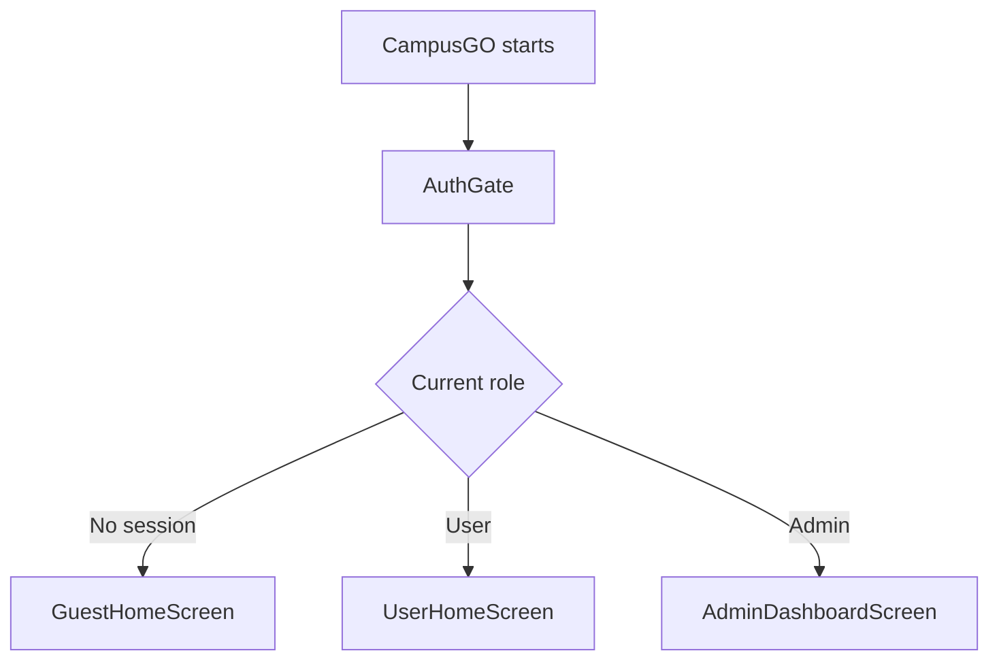

# CampusGO

CampusGO is a Flutter mobile application designed to help users navigate a
university campus and access campus services from one place. The application
uses Supabase for authentication and database storage.

The planned system includes indoor navigation, public timetables, personal
schedules, room bookings, notifications, FAQs, issue reports, user profiles,
and an administration interface.

## Project Status

> **CampusGO is currently an architecture scaffold.**

The folder structure is stable enough for the team to use when dividing tasks.
However, many Dart files are still placeholders containing `TODO` comments.
The role-based login flow, protected routes, Supabase queries, Row Level
Security policies, controllers, and most screen interfaces still need to be
implemented.

At present, the application opens the temporary `HomeScreen` for everyone.
The intended `AuthGate` flow has been designed in the structure but is not yet
connected.

## Technology Stack

| Technology | Purpose |
|---|---|
| Flutter | Builds the mobile application interface |
| Dart | Main programming language |
| Supabase Auth | Handles registered-user and admin authentication |
| Supabase PostgreSQL | Stores the application data |
| Supabase RLS | Enforces database permissions for different roles |
| Material Design | Provides the base Flutter interface components |

## Main Features

- Indoor campus navigation
- Floor and destination search
- Public timetable
- Personal schedule
- Room and facility bookings
- User notifications
- User profiles
- FAQs
- Issue reporting and report history
- Admin dashboard
- Admin management for users, navigation data, timetables, bookings,
  notifications, FAQs, and issue reports

## User Roles

CampusGO supports three interface roles:

| Role | Meaning | Intended starting screen |
|---|---|---|
| Guest | A visitor without an active Supabase login session | `GuestHomeScreen` |
| User | An authenticated regular user | `UserHomeScreen` |
| Admin | An authenticated administrator | `AdminDashboardScreen` |

The three roles receive different starting screens, but they do not have three
separate copies of the application.



### Guest

A guest should be able to use public features such as campus navigation,
public timetables, and FAQs. A guest should not be able to access personal
bookings, schedules, profiles, or notifications.

### Registered User

A registered user should be able to use public features and account-based
features, including personal schedules, bookings, notifications, profiles,
visit history, and issue reporting.

### Admin

An admin should have a separate dashboard for managing the system. The admin
can still use shared screens, but also receives management screens for users,
navigation data, timetables, bookings, notifications, FAQs, and issue reports.

## Architecture

CampusGO uses a **feature-based architecture**. Code is grouped according to
what part of the application it belongs to.

For example, all booking-related code is stored inside:

```text
lib/features/bookings/
```

This includes the booking model, Supabase service, controllers, normal user
screens, admin booking screen, and booking widgets.

The folder answers:

> What feature does this code belong to?

The filename and route permissions answer:

> Which role is allowed to use it?

This means an admin-only booking screen belongs in the booking feature:

```text
lib/features/bookings/views/admin_manage_bookings_screen.dart
```

It remains inside `bookings/` because its purpose is to manage bookings.

## Project Structure

```text
lib/
├── main.dart
│
├── app/
│   ├── app_router.dart
│   ├── app_theme.dart
│   └── campus_go_app.dart
│
├── core/
│   ├── config/
│   │   └── supabase_config.dart
│   ├── constants/
│   │   └── database_tables.dart
│   ├── exceptions/
│   │   └── app_exception.dart
│   └── utils/
│       ├── date_time_formatter.dart
│       └── validation_utils.dart
│
├── shared/
│   └── widgets/
│       ├── app_empty_state.dart
│       ├── app_error_message.dart
│       ├── app_loading_indicator.dart
│       └── app_primary_button.dart
│
└── features/
    ├── auth/
    │   ├── models/
    │   │   └── user_role.dart
    │   ├── services/
    │   │   └── auth_service.dart
    │   ├── controllers/
    │   │   └── auth_controller.dart
    │   ├── views/
    │   │   ├── auth_gate.dart
    │   │   ├── login_screen.dart
    │   │   └── welcome_screen.dart
    │   └── widgets/
    │       ├── guest_access_button.dart
    │       └── role_guard.dart
    │
    ├── home/
    │   ├── views/
    │   │   ├── home_screen.dart
    │   │   ├── guest_home_screen.dart
    │   │   └── user_home_screen.dart
    │   └── widgets/
    │       ├── home_feature_card.dart
    │       └── home_header.dart
    │
    ├── admin/
    │   ├── controllers/
    │   │   └── admin_dashboard_controller.dart
    │   ├── views/
    │   │   └── admin_dashboard_screen.dart
    │   └── widgets/
    │       ├── admin_navigation_drawer.dart
    │       └── admin_stat_card.dart
    │
    ├── profile/
    │   ├── models/
    │   ├── services/
    │   ├── controllers/
    │   ├── views/
    │   └── widgets/
    │
    ├── navigation/
    │   ├── models/
    │   ├── services/
    │   ├── controllers/
    │   ├── views/
    │   └── widgets/
    │
    ├── timetable/
    │   ├── models/
    │   ├── services/
    │   ├── controllers/
    │   ├── views/
    │   └── widgets/
    │
    ├── bookings/
    │   ├── models/
    │   ├── services/
    │   ├── controllers/
    │   ├── views/
    │   └── widgets/
    │
    ├── notifications/
    │   ├── models/
    │   ├── services/
    │   ├── controllers/
    │   ├── views/
    │   └── widgets/
    │
    └── support/
        ├── models/
        ├── services/
        ├── controllers/
        ├── views/
        └── widgets/
```

## What Each Main Folder Does

### `app/`

Contains code that controls the application as a whole.

| File | Responsibility |
|---|---|
| `campus_go_app.dart` | Creates the main `MaterialApp` |
| `app_router.dart` | Defines routes and will protect role-restricted routes |
| `app_theme.dart` | Stores app-wide colours, typography, and component styles |

### `core/`

Contains app-wide technical code that does not belong to one specific feature.

| Folder | Responsibility |
|---|---|
| `config/` | Stores application configuration such as Supabase connection values |
| `constants/` | Stores fixed values such as Supabase table names |
| `exceptions/` | Stores custom application error types |
| `utils/` | Stores reusable helper functions such as validation and date formatting |

### `shared/`

Contains reusable interface components used by several features. A shared
loading indicator or error message does not need separate guest, user, and
admin versions.

### `features/`

Contains the application's functional areas. Each feature owns its models,
services, controllers, screens, and smaller interface components.

## Structure Inside a Feature

| Folder | Responsibility |
|---|---|
| `models/` | Converts Supabase records into Dart objects |
| `services/` | Communicates with Supabase and performs database operations |
| `controllers/` | Manages data, loading state, errors, filters, and user actions |
| `views/` | Contains complete application screens |
| `widgets/` | Contains smaller reusable interface components |

The normal data flow is:

```text
View
  -> Controller
  -> Service
  -> Supabase
  -> Model
  -> Controller
  -> Updated View
```

For example:

```text
BookingsScreen
  -> BookingController
  -> BookingService
  -> Supabase bookings table
  -> BookingModel objects
  -> BookingController
  -> BookingsScreen displays the data
```

Views and widgets should not send queries directly to Supabase.

## How Normal and Admin Screens Share a Feature

The regular user and admin may view the same type of record but perform
different actions.

For example, both sides use:

```text
BookingModel
BookingService
Supabase bookings table
```

The regular user opens:

```text
bookings_screen.dart
create_booking_screen.dart
booking_details_screen.dart
```

The admin opens:

```text
admin_manage_bookings_screen.dart
```

The regular user may view or create their own bookings. The admin may view all
bookings and approve, reject, or manage them. A separate
`AdminBookingModel` is unnecessary because both roles use the same booking
records.

The same rule is used throughout the project:

| Feature | Normal or shared screen | Admin management screen |
|---|---|---|
| Profile | `profile_screen.dart` | `admin_manage_users_screen.dart` |
| Navigation | `navigation_screen.dart` | `admin_manage_navigation_screen.dart` |
| Timetable | `timetable_screen.dart` | `admin_manage_timetable_screen.dart` |
| Bookings | `bookings_screen.dart` | `admin_manage_bookings_screen.dart` |
| Notifications | `notifications_screen.dart` | `admin_manage_notifications_screen.dart` |
| FAQs | `faq_screen.dart` | `admin_manage_faq_screen.dart` |
| Issue reports | `issue_report_screen.dart` | `admin_manage_issue_reports_screen.dart` |

The separate `features/admin/` folder contains only the overall admin
dashboard, admin navigation, and dashboard widgets. Detailed management screens
remain beside the feature they manage.

## Supabase Table Mapping

| Supabase table | Feature | Dart model | Main service |
|---|---|---|---|
| `profile` | Profile | `ProfileModel` | `ProfileService` |
| `floors` | Navigation | `FloorModel` | `NavigationService` |
| `nodes` | Navigation | `NodeModel` | `NavigationService` |
| `edges` | Navigation | `EdgeModel` | `NavigationService` |
| `visit_histories` | Navigation | `VisitHistoryModel` | `NavigationService` |
| `timetable` | Timetable | `TimetableModel` | `TimetableService` |
| `my_schedule` | Timetable | `ScheduleModel` | `ScheduleService` |
| `bookings` | Bookings | `BookingModel` | `BookingService` |
| `notification` | Notifications | `NotificationModel` | `NotificationService` |
| `faq` | Support | `FaqModel` | `FaqService` |
| `issue_reports` | Support | `IssueReportModel` | `IssueReportService` |

Authentication is handled by Supabase Auth. Additional user information and
the final role value should be stored in the `profile` table.

## Access Control

Role protection must exist at three connected layers:

| Layer | Responsibility |
|---|---|
| `AuthGate` and conditional widgets | Control what the person sees |
| `AppRouter` route guards | Control which screens the person can open |
| Supabase RLS policies | Control which database records and operations are allowed |

Hiding an admin button is not sufficient security. Supabase must also reject
unauthorized inserts, updates, and deletes.

### Recommended Access Matrix

| Capability | Guest | User | Admin |
|---|:---:|:---:|:---:|
| View public navigation | Yes | Yes | Yes |
| View public timetable | Yes | Yes | Yes |
| Read FAQs | Yes | Yes | Yes |
| View own profile | No | Yes | Yes |
| Save a personal schedule | No | Yes | Yes |
| Create and view own bookings | No | Yes | Yes |
| View own notifications | No | Yes | Yes |
| Manage all users | No | No | Yes |
| Manage navigation data | No | No | Yes |
| Manage timetable data | No | No | Yes |
| Manage all bookings | No | No | Yes |
| Publish notifications | No | No | Yes |
| Manage FAQs and issue reports | No | No | Yes |

## Current Flow and Intended Flow

The current scaffold still uses this temporary flow:

```text
main.dart
  -> CampusGoApp
  -> AppRoutes.home
  -> HomeScreen
```

Therefore, guest, user, and admin currently see the same temporary screen.

The completed implementation should use:

```text
main.dart
  -> CampusGoApp
  -> AuthGate
  -> GuestHomeScreen, UserHomeScreen, or AdminDashboardScreen
```

`home_screen.dart` can be removed or repurposed after `AuthGate` and the route
guards are implemented and tested.

## Getting Started

### Prerequisites

- Flutter SDK with Dart 3.9 or later
- VS Code or Android Studio
- Xcode for the iOS Simulator on macOS
- Android Studio for an Android emulator
- Access to the CampusGO Supabase project

### Install and Run

```bash
git clone <repository-url>
cd cs_go
flutter pub get
flutter doctor
flutter devices
flutter run
```

To run a specific available device:

```bash
flutter run -d <device-id>
```

### Supabase Configuration

The Supabase project URL and publishable key are read from:

```text
lib/core/config/supabase_config.dart
```

Only use the project's client-safe publishable or anonymous key in the Flutter
application. Never add the Supabase `service_role` key to the app or commit it
to GitHub.

## Development Checks

Before opening a pull request, run:

```bash
dart format lib test
flutter analyze
flutter test
```

Fix formatting, analysis, and test errors before merging the branch.

## Naming Conventions

| Item | Convention | Example |
|---|---|---|
| Files and folders | `snake_case` | `booking_model.dart` |
| Classes and enums | `PascalCase` | `BookingModel` |
| Variables and methods | `camelCase` | `bookingId` |
| Supabase tables and columns | `snake_case` | `booking_id` |

A Supabase column such as `booking_id` can be represented in Dart as
`bookingId`.

## Team Development Rules

1. Divide work by feature rather than by role.
2. The owner of a feature should normally handle its regular and admin
   workflows because they share the same models, services, tables, and rules.
3. Keep Supabase queries inside service files.
4. Keep loading state, error state, filters, and user actions inside
   controllers.
5. Keep complete pages inside `views/` and smaller reusable components inside
   `widgets/`.
6. Reuse shared screens when different roles have the same purpose and layout.
7. Create a separate admin screen only when the admin workflow is substantially
   different.
8. Do not duplicate models merely because an admin can access the same record.
9. Protect admin actions in Flutter routes and Supabase RLS.
10. Do not overwrite another team member's files without reviewing their work.

### Suggested Git Workflow

Create one branch for each task:

```bash
git checkout main
git pull origin main
git checkout -b feature/bookings
```

After completing and checking the work:

```bash
git add .
git commit -m "Implement booking feature"
git push -u origin feature/bookings
```

Open a pull request and ask another team member to review it before merging.

Useful branch-name examples:

```text
feature/auth
feature/navigation
feature/timetable
feature/bookings
feature/notifications
feature/support
feature/admin-dashboard
fix/booking-validation
```

## Recommended Implementation Order

1. Confirm the final columns in every Supabase table.
2. Confirm the exact profile role values, such as `user` and `admin`.
3. Implement `AuthService`, `AuthController`, and `AuthGate`.
4. Connect `AppRouter` and add role-based route guards.
5. Implement models using the confirmed Supabase columns.
6. Implement services and Supabase queries.
7. Implement controllers and application state.
8. Build the guest, user, and admin interfaces.
9. Create and test Supabase RLS policies.
10. Add unit, widget, and integration tests.

## Important Reminder

The folder structure defines where code belongs; it does not automatically
create permissions.

```text
Folder location
  = organizes the project

Flutter role checks
  = control the visible interface

AppRouter
  = controls screen navigation

Supabase RLS
  = provides the real database protection
```

CampusGO should only be considered role-secure when all three protection layers
have been implemented and tested.
